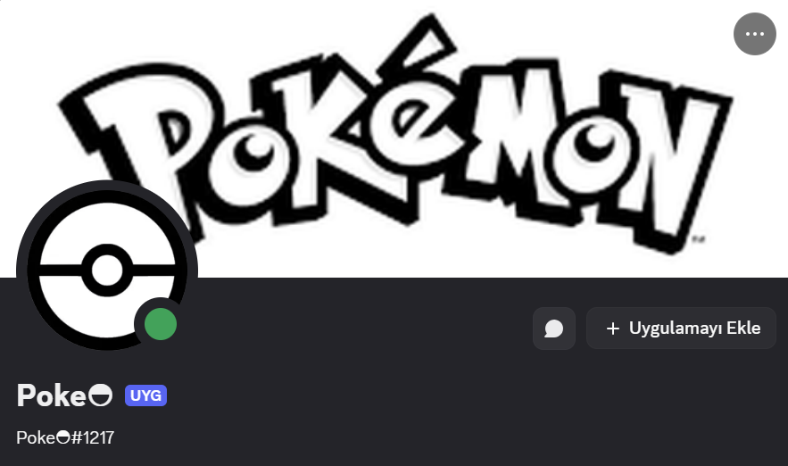
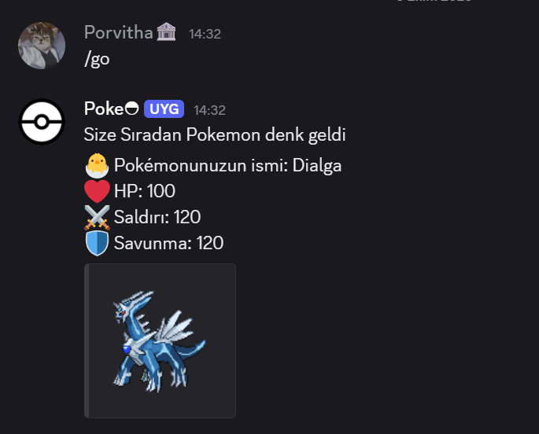
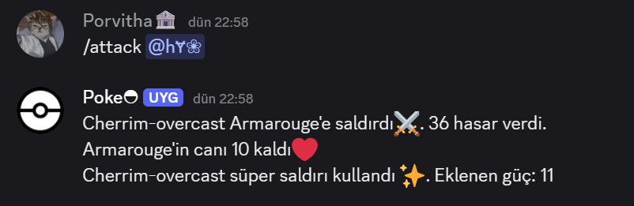

# 🌟 Pokémon Discord Botu 🚀

Selam Discord Bağımlıları!  
Bu bot sayesinde Discord sunucunda kendi Pokémon dünyanı yaratabilir, savaşlara katılabilir ve Pokémon’larını besleyip güçlendirebilirsin!  

Farklı tür Pokémonlar seni bekliyor:  
- 🐣 **Sıradan Pokémon** → Maceranın başlangıcı  
- 🥊 **Fighter (Savaşçı)** → Güç ve saldırı odaklı  
- 🧙 **Wizard (Büyücü)** → Strateji ve savunma ustası  

---

## ⚡ Öne Çıkan Özellikler

✨ **Pokémon Yakala:** `/go` ile kendi Pokémon’unu seç!  
🍎 **Besle ve Güçlendir:** `/feed` ile HP artır, Pokémon’unu sağlıklı tut!  
🗑️ **Sil ve Yeniden Başla:** `/sil` ile Pokémonunu sil, Pcon harcayarak temiz bir başlangıç yap!  
📊 **Bilgi Al:** `/inf` ile Pokémon istatistiklerini gör, stratejini belirle!  
💰 **Pcon Durumu:** `/coin` ile kazandığın veya harcadığın Pcon’leri takip et!  
⚔️ **Savaş:** `/attack @kullanıcı` ile diğer kullanıcılarla kıyasıya mücadele et! 

---

## 🎮 Kullanım Talimatları

1. Botu Discord sunucuna ekle  
2. `/go` komutuyla Pokémonunu yakala  
3. `/feed` ile besle, `/inf` ile gücünü kontrol et  
4. `/attack @kullanıcı` ile meydan oku  
5. Pcon biriktir ve oyununu yükselt! 💎 

> Not: Saldırılarda ve beslemede bekleme sürelerine dikkat et, stratejini buna göre kur! ⏱️

---
## 📸 Ekran Görüntüleri

**Bot:**  

---
**Pokémon Kazanma:**  

---

**Savaş Anı:**  

---

## 🌈 Ekstra Parlak Özellikler
- Her Pokémon kendi istatistiklerine ve özel güçlerine sahip ⚡  
- Savaşlar tamamen rastgele olaylarla dinamik hale geliyor 🎲
- Her Pokémonun statları orjinal API dan geliyor! 🐣 
- Emojiler ve renklerle Discord deneyimi daha eğlenceli! 🌟  
- Oyunlaştırılmış Pcon sistemiyle rekabetçi ve ödüllendirici 💰  

---

“Discord sunucunda kendi Pokémon efsaneni yarat!” 🐉💫

